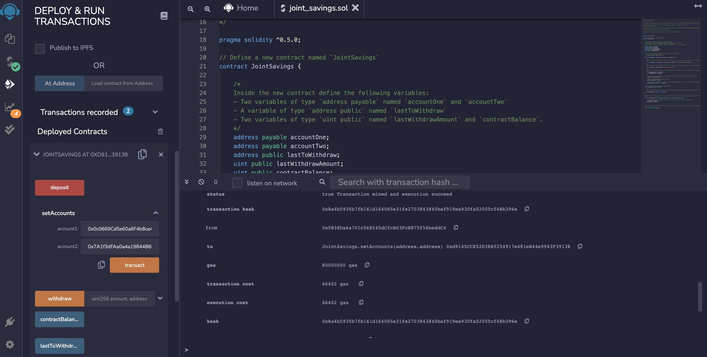
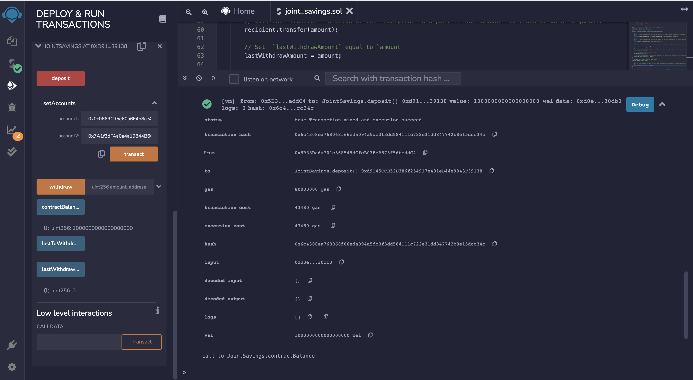
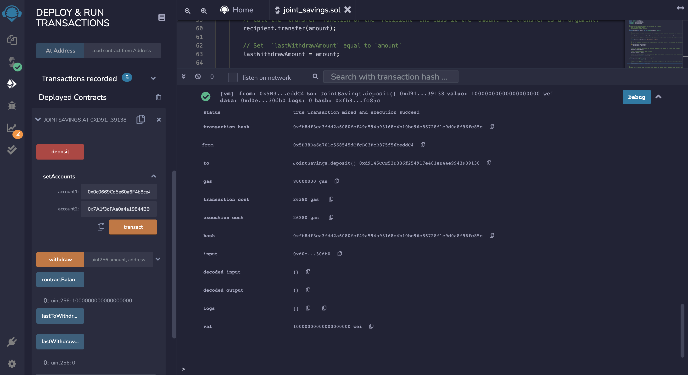
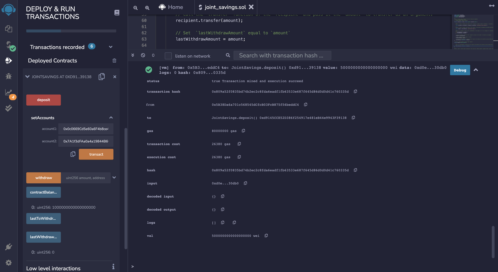
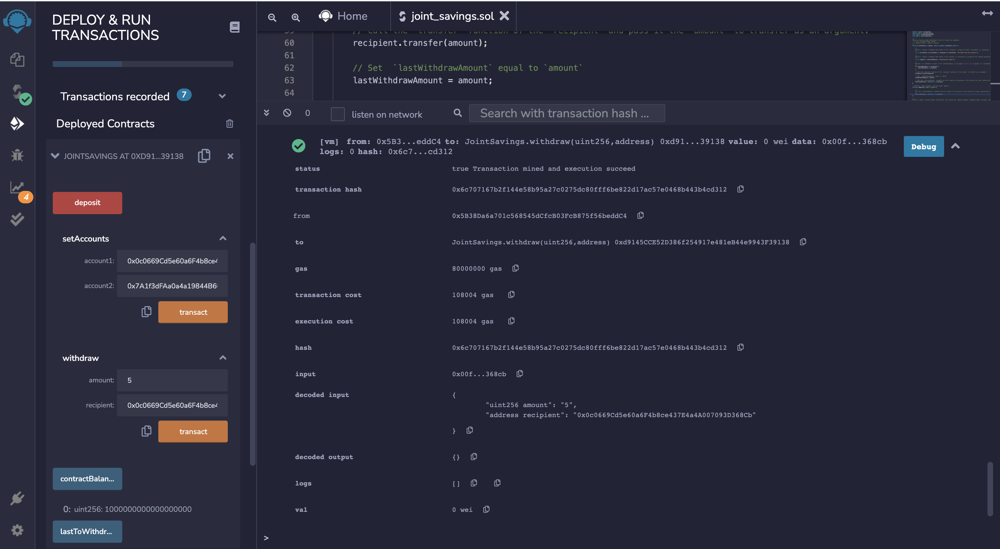
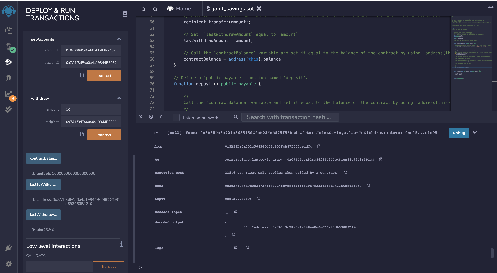
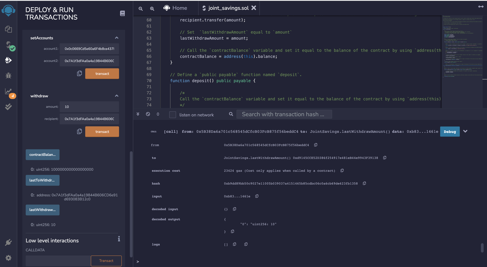

# FinTechBootcamp_Assignments_20

##Screenshot for executing setAccounts function

##Screenshot for executing deposit function

Transaction 1: Send 1 ether as wei

Transaction 2: Send 10 ether as wei

Transaction 3: Send 5 ether

##Screenshot for executing withdraw function

Withdraw 5 ether into account one

Withdraw 10 ether into account two

##Screenshot for executing lastToWithdraw function

##Screenshot for executing lastWithdrawAmount function

